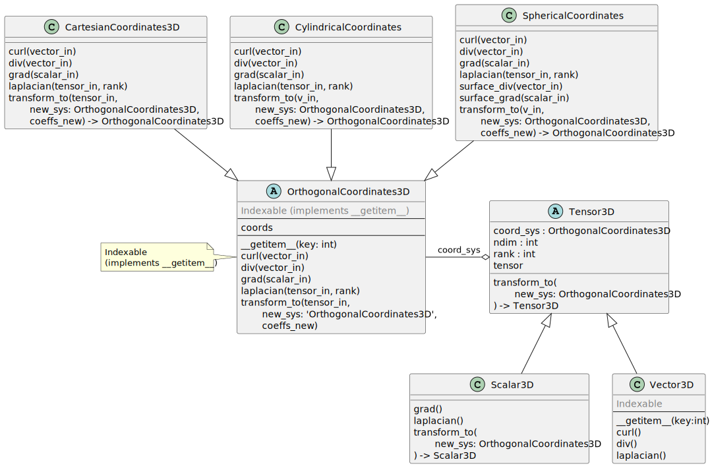
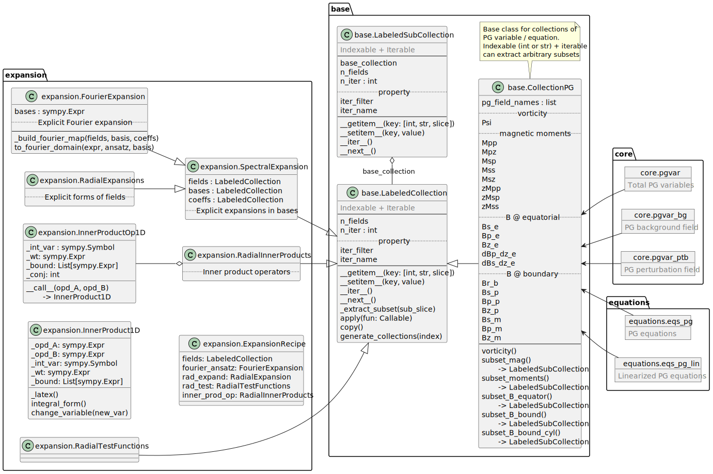

# PlesioGeostroPy: Plesio-Geostrophy Model in Python

This repo offers a realization for the Plesio-geostrophy (PG) model, a reduced dimensional model for MHD equations in an axisymmetric geometry with nearly geostrophic velocity ansatz. The model is proposed by [Jackson and Maffei, 2020](https://doi.org/10.1098/rspa.2020.0513).

Ingredients of the system:
- Navier-Stokes equation (optionally with uniform viscous diffusivity) in the (rapidly) rotating frame
- Magnetic induction equation (optionally with uniform magnetic diffusivity)
- Plesio-geostrophy Ansatz (perhaps first proposed by Schaeffer and Cardin?)

$$\mathbf{u} = \frac{1}{H}\nabla\times \psi \hat{\mathbf{z}} + \frac{z}{sH^2}\frac{dH}{ds}\frac{\partial \psi}{\partial \phi} \hat{\mathbf{z}}$$

Systems fulfilling these conditions can be exactly described using the PG model.

## Eigenvalue problems

Framework of eigenvalue solver set up

- [x] Malkus background field
- [ ] Toroidal quadrupolar field
- [ ] Poloidal dipolar field

## Data Assimilation

*Future work*

## Current code implementation and design

The [documentation](https://gentlemin.github.io/PlesioGeostroPy/) (currently only API reference) is now available. Tutorials can be added in the future if necessary.

Module vector calculus in 3D `pg_utils.sympy_supp`:

Module PG model `pg_utils.pg_model`:

Red items are items to be implemented.

